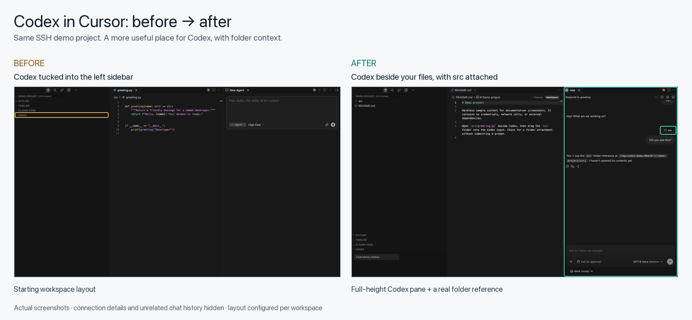
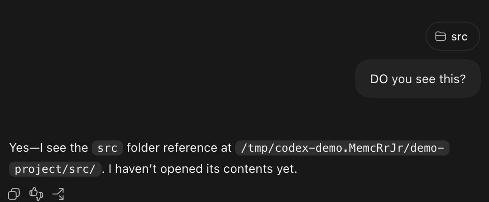
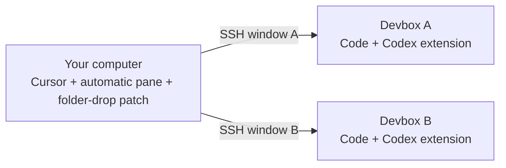

# Codex in Cursor, on your devbox

**Keep your code in Cursor. Give Codex a full-height pane beside it. Drag a folder into the conversation.**

This community toolkit helps you use the Codex extension inside Cursor while working on a remote development machine over SSH. It opens Codex automatically on the right, adds folder drag-and-drop for the supported Cursor build, and includes a targeted repair for one extension startup error.

[Get started](#get-started) · [Installation guide](docs/setup.md) · [Give this to an agent](docs/fresh-agent-prompt.md) · [Compatibility](#compatibility)

## Before and after

**Before:** the demo workspace starts with Codex tucked into Explorer. **After:** Codex has its own pane beside the project files, and `src` is attached to the conversation. These are real screenshots of the same SSH demo project, with connection details and unrelated chat history hidden.

[View before at full size](docs/images/before-default-layout.png) · [View after at full size](docs/images/after-configured-layout.png) · [Capture notes](docs/visuals.md)

## What does it add?

| In your workflow | What this project provides |
| --- | --- |
| You want Codex beside your code whenever a project opens. | A local companion extension that opens Codex automatically on the right, with Explorer still visible. |
| You want to point Codex at a whole folder. | A patch that turns an Explorer folder drop into a folder reference in the Codex input. |
| You switch between SSH devboxes. | Folder handling that uses the active connection and its paths, without a fixed host name or home directory. |
| Codex fails to open on the supported remote build. | An optional repair for the specific startup syntax error described in the guide. |

A **devbox** is the remote computer where your code lives. Cursor runs on your own computer and connects to it through SSH.

## See the workflow

### 1. Code on the left. Codex on the right.

Install **Codex Pane for Cursor** once on your computer. When you open a trusted project, it waits for Codex to connect and opens it on the right. Existing Codex conversations are reused. No command-palette routine is needed for each workspace.

Close the pane whenever you want; it stays closed for that window session. Click **Codex** in the status bar to bring it back. [Installation and settings →](docs/setup.md#automatic-codex-pane-on-the-right)

### 2. Drag a folder into Codex.

Drag a directory from Explorer into the Codex input. The expected result is a visible folder attachment, so you can refer to that directory in your next request. The patch passes a folder reference; it does not copy or upload the directory contents itself.

*The folder reference is visible in the conversation after the demo user sends a message.*

### 3. Use the same local patch with other devboxes.

Install the companion and apply the folder patch once per Cursor installation. Each devbox still needs a working Codex extension. A drop belongs to the current connection; this is not a tool for moving folders between servers.

## Get started

**Using a coding agent?** Give it the [ready-to-copy setup prompt](docs/fresh-agent-prompt.md) and access to this repository. It will start with [AGENTS.md](AGENTS.md) and the [step-by-step runbook](docs/agent-runbook.md). No previous conversation is needed.

**Setting it up yourself?** Follow the [installation guide](docs/setup.md):

1. Check that your Cursor and extension versions match the supported profiles below.
2. Connect to your devbox in Cursor and get the Codex extension working.
3. Run the local patch’s `plan`, `apply`, and `verify` commands.
4. Install the local pane companion, reopen a project, and check that Codex appears on the right and a real folder drop produces an attachment.

The guide includes exact commands, backups, troubleshooting, and rollback. The optional remote startup repair is only needed when its specific error occurs.

## Compatibility

**This is an experimental, version-specific customization.** It is not an official Cursor or OpenAI integration, and Codex uses an editor group rather than Cursor’s native agent tabs.

| Component | Supported profile |
| --- | --- |
| Cursor client | macOS, **3.18.25** |
| Automatic pane companion | **0.1.0**, tested with Cursor **3.18.25** and Codex **26.901.22334** |
| Optional Codex startup repair | **26.901.22334**, Linux x64 extension package |
| Remote runtime observed with the startup error | Node **22.22.1** |
| Toolkit requirements | Python **3.10+** and Node.js **22+**; no package installation |

The patch scripts check the version and exact file fingerprints before applying changes. Other builds are rejected until a compatible profile is added and tested. The pane companion uses editor commands and does not alter application bundles; its Codex editor route still needs verification on other extension versions.

> **Before installing:** the local patch changes Cursor’s application files and triggers its modified/corrupt installation warning. The toolkit keeps that integrity check intact. Updates may overwrite the patch. Originals are backed up, and the guide includes restore commands.

The final patch was verified in the installed Cursor bundles, and a real folder drop was confirmed on one Linux SSH devbox—the screenshots above show the result. Isolated multi-host tests and installed-serializer checks also passed. It has **not** been tested live across multiple devboxes. Read the [verification notes](docs/verification.md) for the exact scope.

## Go deeper

- [Installation and rollback](docs/setup.md) — commands for your computer and each devbox.
- [Agent runbook](docs/agent-runbook.md) — diagnosis, implementation details, and recovery.
- [Fresh-agent prompt](docs/fresh-agent-prompt.md) — hand this project to another agent.
- [Development and tests](docs/development.md) — run the checks or work on a new profile.

Found an unsupported version or a reproducible issue? [Open an issue](https://github.com/malhajar17/cursor-codex-devbox/issues) with your OS, versions, and a redacted error. Keep credentials, SSH configuration, and private project details out of reports.
